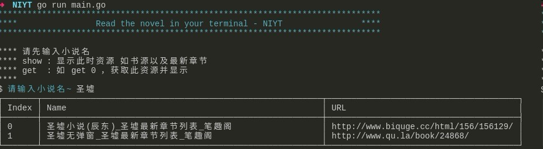
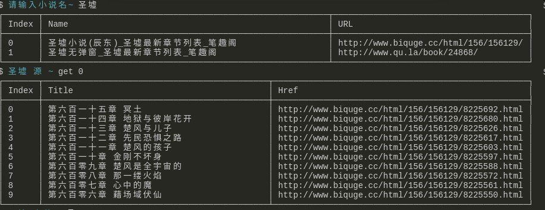
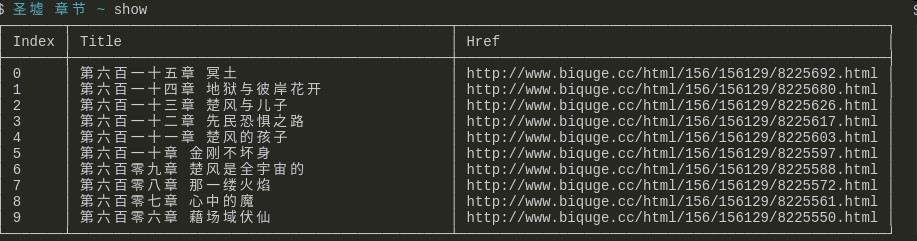

## Read the novel in your terminal - NIYT

> 这几天在看`go`，所以这是个练手项目，在终端里看小说

这是个无聊的项目

这真是个无聊的项目

### 1.How to use?

``` shell
# 方式一
git clone https://github.com/howie6879/NIYT.git
cd NIYT
go run main.go

# 方式二
# 若您无go环境，请直接下载编译好的版本，下面是编译语句
CGO_ENABLED=0 GOOS=darwin GOARCH=amd64 go build -o ./release/NIYT.mac
CGO_ENABLED=0 GOOS=windows GOARCH=amd64 go build -o ./release/NIYT.exe
CGO_ENABLED=0 GOOS=linux GOARCH=amd64 go build  -o ./release/NIYT.linux

```

**编译好的可执行文件**，请在[release](https://github.com/howie6879/NIYT/releases)下载对应的版本

直接运行即可：

``` shell

# 运行下载的`NIYT.linux` 这样就可以直接执行使用
./NIYT.linux

# 若提示无法运行，例如在mac下
chmod a+x NIYT.mac
# 再运行即可
./NIYT.mac

```

首先输入小说名称，调用第三方搜索，终端就会显示小说源：



利用`get 2`进入提示相应最快的源，获取最新章节：


选择章节进行阅读，如阅读最新章节，`get 0`:


`show` 会以表格的形式再次展示当前源：


**享受阅读吧**